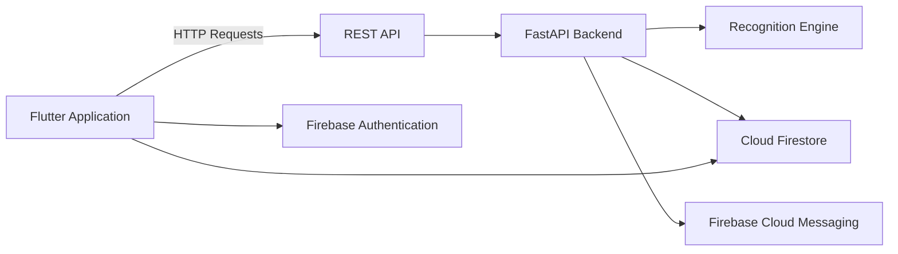
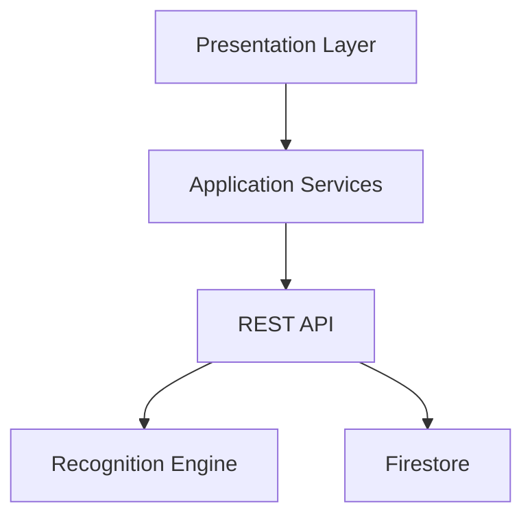
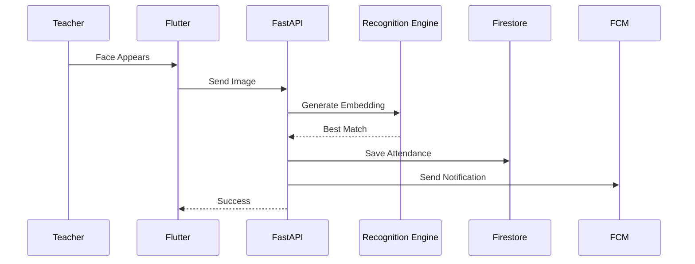
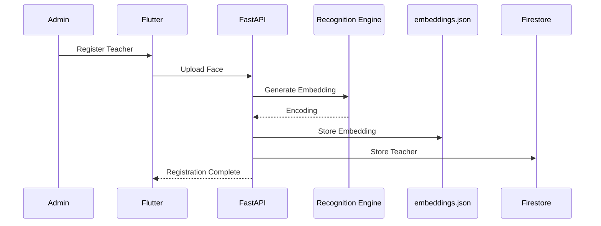
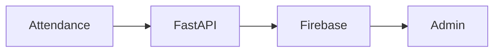
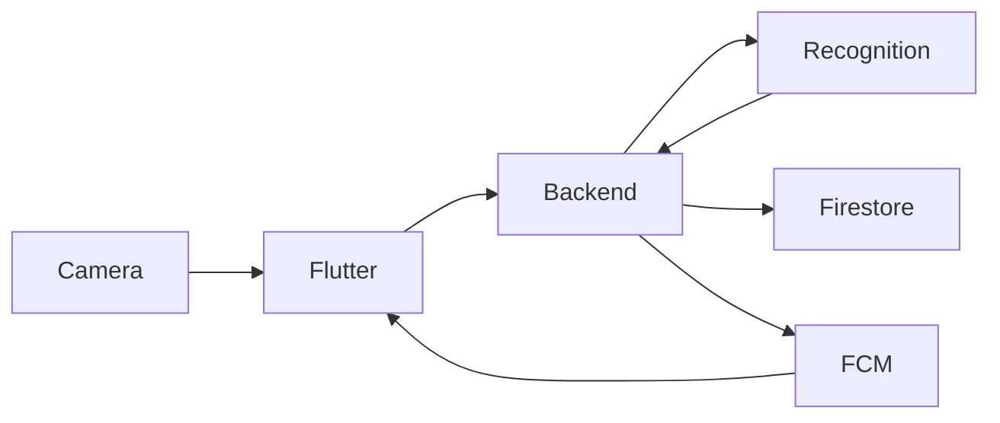

# System Architecture

**Project:** Face-Mark

**Version:** 1.0

---

# 1. Overview

Face-Mark follows a **client-server architecture** where a Flutter mobile application communicates with a FastAPI backend through REST APIs.

The backend performs facial recognition, attendance processing, and Firebase interactions while the frontend provides the user interface for administrators and the attendance kiosk.

The system is designed around clear separation of concerns:

* Presentation Layer
* Service Layer
* Backend API Layer
* Recognition Engine
* Data Layer

---

# 2. High-Level Architecture



---

# 3. Major Components

## Flutter Frontend

Responsible for:

* User Interface
* Camera Preview
* Authentication
* Navigation
* API Communication
* Firestore Synchronization

Main modules:

* Screens
* Widgets
* api_service.dart
* attendance_service.dart

---

## FastAPI Backend

Responsible for:

* REST APIs — *For detailed route definitions, request validation models, and response structures, see the [API Specification](file:///D:/GitHub/face-mark/docs/API_SPEC.md).*
* Face recognition
* Attendance processing
* Embedding generation
* Notification triggers
* Firestore updates

Main files:

* main.py
* firebase_utils.py

---

## Recognition Engine

Uses:

* face_recognition
* dlib
* NumPy
* OpenCV

Responsibilities:

* Face detection
* Encoding generation
* Similarity comparison
* Teacher identification

---

## Firebase

Provides:

* Authentication
* Firestore
* Cloud Messaging

---

# 4. Layered Architecture



---

# 5. Frontend Architecture

The Flutter application follows a modular architecture.

```text
lib/

├── screens/
├── widgets/
├── api_service.dart
├── attendance_service.dart
└── main.dart
```

### Responsibilities

### Screens

Handle:

* User interaction
* Navigation
* State updates

---

### Widgets

Contain reusable UI components.

Examples:

* Teacher Card
* Attendance Tile
* Status Badge
* Loading Indicator

---

### api_service.dart

Responsible for:

* HTTP requests
* JSON serialization
* API responses
* Error handling

---

### attendance_service.dart

Responsible for:

* Attendance synchronization
* Firestore interaction
* Attendance state management

---

# 6. Backend Architecture

```text
backend/

main.py
firebase_utils.py
embeddings.json
profile_photos/
```

---

## main.py

Responsibilities:

* API routing
* Request validation
* Recognition pipeline
* Attendance logic

---

## firebase_utils.py

Responsibilities:

* Firebase initialization
* Firestore operations
* Push notifications

---

## embeddings.json

Stores:

* Teacher ID
* Face embedding
* Metadata

This file acts as the local embedding store for Version 1.0.

---

## profile_photos/

Stores cropped teacher profile images for recognition and display purposes.

---

# 7. Request Flow

## Attendance Recognition



---

# 8. Registration Flow



---

# 9. Authentication Flow


---

# 10. Notification Flow



---

# 11. Data Flow



---

# 12. Architectural Decisions

## Monorepo

Frontend and backend are maintained in a single repository.

Benefits:

* Easier version control
* Shared documentation
* Simplified deployment
* Single source of truth

---

## Flutter

Chosen because:

* Cross-platform support
* Native performance
* Rich UI framework

---

## FastAPI

Chosen because:

* High performance
* Automatic API documentation
* Strong typing
* Easy asynchronous support

---

## Firebase

Chosen because:

* Managed authentication
* Real-time database
* Push notifications
* Minimal backend configuration

---

## Local Embeddings

Version 1.0 stores embeddings locally in `embeddings.json`.

Advantages:

* Simple implementation
* Fast lookup
* Easy debugging

Future versions may migrate embeddings to cloud storage or a dedicated vector database.

---

# 13. Scalability Considerations

Current architecture supports:

* Hundreds of teachers
* Multiple administrators
* Single institution deployment

Future improvements:

* Horizontal backend scaling
* Cloud embedding storage
* Multi-campus support
* Load balancing
* Containerized deployment
* Distributed recognition services

---

# 14. Security Boundaries

Protected components:

* Firebase Authentication
* Firestore Rules
* Backend APIs
* Local embedding storage

All sensitive operations require authenticated administrator access.

---

# 15. Future Architecture

Future versions may introduce:

* Web dashboard
* Docker deployment
* CI/CD pipelines
* Reverse proxy
* Background worker queues
* Vector database for embeddings
* Liveness detection service
* Analytics microservice

---

# End of Document
