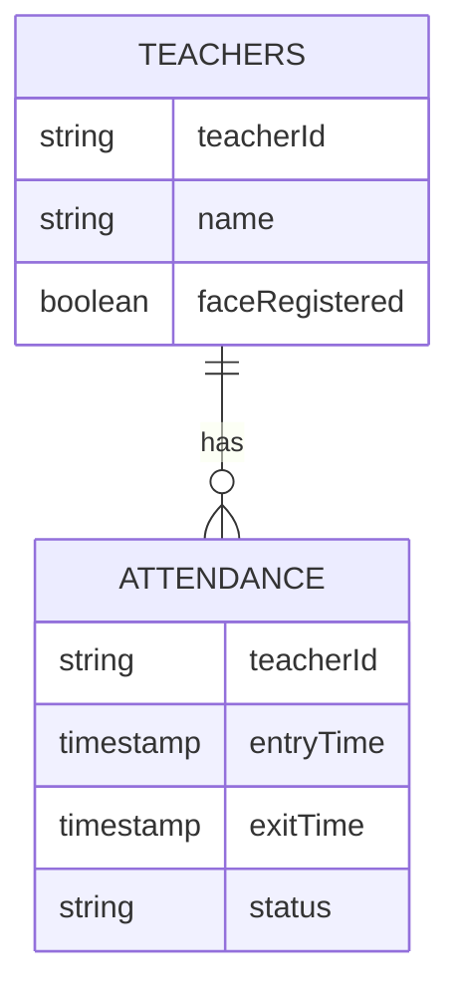

# Database Schema

**Project:** Face-Mark

**Version:** 1.0

---

# 1. Overview

Face-Mark uses **Google Cloud Firestore** as its primary cloud database for storing application data. Firestore provides a scalable, document-oriented NoSQL database that synchronizes data in real time between the backend and frontend.

Local facial embeddings are intentionally **not stored in Firestore** in Version 1.0. Instead, they are maintained in `backend/embeddings.json` for simplicity and performance.

---

# 2. Data Storage Strategy

| Data                     | Storage                   |
| ------------------------ | ------------------------- |
| Teacher Information      | Firestore                 |
| Attendance Records       | Firestore                 |
| Administrator Accounts   | Firebase Authentication   |
| Face Embeddings          | Local (`embeddings.json`) |
| Profile Images           | Local (`profile_photos/`) |
| Push Notification Tokens | Firestore                 |

---

# 3. Firestore Collections

The database consists of the following top-level collections:

```text id="3x3m6h"
Firestore

├── teachers/
├── attendance/
└── admin_devices/
```

---

# 4. Teachers Collection

Stores information about every registered teacher.

Collection:

```text id="tt3s8a"
teachers/
```

Document ID:

```
teacherId
```

Example Document:

```json
{
  "teacherId": "TCH001",
  "name": "John Doe",
  "email": "john@example.com",
  "department": "Computer Engineering",
  "faceRegistered": true,
  "createdAt": "...",
  "updatedAt": "..."
}
```

---

## Fields

| Field          | Type      | Required | Description                                   |
| -------------- | --------- | -------- | --------------------------------------------- |
| teacherId      | String    | Yes      | Unique teacher identifier                     |
| name           | String    | Yes      | Teacher's full name                           |
| email          | String    | Optional | Contact email                                 |
| department     | String    | Optional | Department or subject                         |
| faceRegistered | Boolean   | Yes      | Indicates whether face enrollment is complete |
| createdAt      | Timestamp | Yes      | Record creation time                          |
| updatedAt      | Timestamp | Yes      | Last update time                              |

---

## Validation Rules

* `teacherId` must be unique.
* `name` cannot be empty.
* `faceRegistered` defaults to `false`.
* Timestamps are generated by the backend.

---

# 5. Attendance Collection

Stores daily attendance records.

Collection:

```text id="knr7c9"
attendance/
```

Document ID:

```
Auto Generated
```

Example Document:

```json
{
  "teacherId": "TCH001",
  "teacherName": "John Doe",
  "date": "2026-06-27",
  "entryTime": "...",
  "exitTime": "...",
  "status": "Checked Out",
  "confidence": 0.97
}
```

---

## Fields

| Field       | Type      | Required | Description              |
| ----------- | --------- | -------- | ------------------------ |
| teacherId   | String    | Yes      | Reference to teacher     |
| teacherName | String    | Yes      | Cached teacher name      |
| date        | Date      | Yes      | Attendance date          |
| entryTime   | Timestamp | Yes      | Check-in time            |
| exitTime    | Timestamp | Optional | Check-out time           |
| status      | String    | Yes      | Current attendance state |
| confidence  | Number    | Yes      | Recognition confidence   |

---

## Attendance States

Allowed values:

* Checked In
* Checked Out

Future versions:

* Late
* On Leave
* Absent

---

# 6. Admin Devices Collection

Stores Firebase Cloud Messaging tokens.

Collection:

```text id="4mt7t5"
admin_devices/
```

Example Document:

```json
{
  "uid": "firebaseUid",
  "deviceToken": "...",
  "platform": "android",
  "lastSeen": "..."
}
```

---

## Fields

| Field       | Type      | Description              |
| ----------- | --------- | ------------------------ |
| uid         | String    | Firebase user identifier |
| deviceToken | String    | FCM registration token   |
| platform    | String    | Android                  |
| lastSeen    | Timestamp | Last active timestamp    |

---

# 7. Relationships



---

# 8. Local Runtime Storage

## embeddings.json

Purpose:

Store teacher metadata and dynamic facial embeddings generated during enrollment and self-learning.

Example Structure:

```json
{
  "TCH001": {
    "name": "John Doe",
    "phone": "9876543210",
    "profile_photo": "TCH001_1719472930222.jpg",
    "embeddings": [
      [0.042, -0.112, 0.089, " (128-dimensional float list)"],
      [0.045, -0.110, 0.087, " (multiple embeddings supported)"]
    ]
  }
}
```

This file is generated automatically by the backend and is not committed to version control.

---

## profile_photos/

Contains cropped teacher profile images.

These images are:

* Generated during enrollment
* Used for debugging
* Used for profile display (optional)

---

# 9. Data Lifecycle

## Teacher Registration

1. Administrator creates teacher.
2. Teacher document is added to Firestore.
3. Face enrollment generates embedding.
4. `faceRegistered` becomes `true`.

---

## Attendance Recording

1. Teacher recognized.
2. Backend validates recognition.
3. Attendance document created or updated.
4. Notification sent.
5. Dashboard refreshes.

---

## Teacher Deletion

1. Teacher document removed.
2. Local embedding removed.
3. Cached profile image removed.
4. Historical attendance records remain for auditing.

---

# 10. Firestore Security

Only authenticated administrators should have permission to:

* Create teachers
* Update teachers
* Delete teachers
* Read attendance
* Register devices

Attendance records should never be writable directly from unauthenticated clients.

---

# 11. Firestore Indexes

Recommended indexes:

### Teachers

* name
* department

---

### Attendance

Composite index:

* teacherId + date

Composite index:

* status + date

Composite index:

* date (descending)

---

# 12. Future Schema Improvements

Planned additions:

### teachers

* phoneNumber
* designation
* profilePhotoUrl
* campusId

---

### attendance

* location
* deviceId
* attendanceMethod
* livenessScore

---

### New Collections

```text id="gscbna"
campuses/

settings/

departments/

audit_logs/

analytics/
```

---

# 13. Backup Strategy

Current MVP:

* Firestore managed backups.
* Local `embeddings.json` backed up manually.

Future versions:

* Automated cloud backup.
* Versioned embedding storage.
* Scheduled database exports.

---

# 14. Data Integrity Rules

The backend is responsible for enforcing:

* Unique teacher identifiers.
* One active attendance session per teacher.
* No duplicate check-ins.
* Consistent attendance status transitions.
* Synchronization between Firestore and local embedding storage.

Firestore should never be the only source of truth for facial embeddings in Version 1.0.

---

# End of Document
