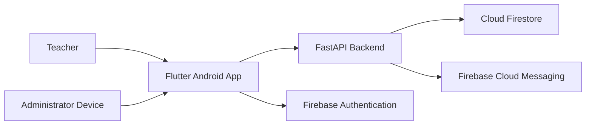

# Deployment Guide

**Project:** Face-Mark

**Version:** 1.0

---

# 1. Overview

This document describes the deployment process for Face-Mark, including the Flutter application, FastAPI backend, Firebase services, and production environment considerations.

The Version 1.0 deployment is designed for a single institution but can be extended to support larger deployments in future releases.

---

# 2. Deployment Architecture



---

# 3. Production Components

The production environment consists of:

| Component                | Purpose                  |
| ------------------------ | ------------------------ |
| Flutter Application      | User interface           |
| FastAPI Server           | Recognition & attendance |
| Firestore                | Cloud database           |
| Firebase Authentication  | Authentication           |
| Firebase Cloud Messaging | Notifications            |

---

# 4. Environment Requirements

## Backend

Minimum:

* Python 3.10+
* 2 CPU cores
* 4 GB RAM
* SSD storage

Recommended:

* Ubuntu Server 22.04 LTS
* 4 CPU cores
* 8 GB RAM

---

## Mobile Device

Recommended:

* Android 10+
* Rear camera
* Stable internet connection

---

# 5. Backend Deployment

Clone repository.

```bash
git clone https://github.com/akh1l1202/face-mark.git

cd face-mark/backend
```

Create virtual environment.

```bash
python -m venv venv
```

Activate environment.

Install dependencies.

```bash
pip install -r requirements.txt
```

Run server.

```bash
uvicorn main:app --host 0.0.0.0 --port 8000
```

---

# 6. Reverse Proxy (Recommended)

Production deployments should place FastAPI behind a reverse proxy such as:

* Nginx
* Caddy
* Apache

Responsibilities include:

* HTTPS termination
* Request forwarding
* Compression
* Security headers

---

# 7. HTTPS

All production API communication should use HTTPS.

Benefits:

* Encrypts traffic
* Protects authentication tokens
* Prevents interception of requests

---

# 8. Firebase Configuration

Production Firebase setup should include:

* Authentication
* Firestore
* Cloud Messaging

Verify:

* Security Rules
* Firestore Indexes
* Android Application Registration

---

# 9. Flutter Release Build

Generate release APK.

```bash
flutter build apk --release
```

Or generate Android App Bundle.

```bash
flutter build appbundle
```

---

# 10. Environment Configuration

Production values should not be hardcoded.

Examples include:

* Backend URL
* Firebase project identifiers
* API keys
* Feature flags

Configuration should be environment-specific.

---

# 11. Required Files

Backend:

* `requirements.txt`
* `main.py`
* `firebase_utils.py`

Frontend:

* `pubspec.yaml`
* `google-services.json`

---

# 12. Deployment Checklist

Before deployment:

* Backend starts successfully.
* Flutter release build succeeds.
* Firestore rules deployed.
* Firestore indexes deployed.
* Firebase Authentication enabled.
* Camera permissions verified.
* Notifications tested.
* Attendance synchronization verified.

---

# 13. Monitoring

Monitor:

* Backend availability
* API response times
* Firestore errors
* Recognition failures
* Notification delivery
* Application crashes

---

# 14. Backup Strategy

Back up:

* Firestore database
* `embeddings.json`
* `profile_photos/`

Backups should be performed regularly and stored securely.

---

# 15. Scaling Considerations

Version 1.0 targets a single deployment.

Future scaling strategies include:

* Multiple backend instances
* Load balancing
* Shared embedding storage
* Vector database integration
* Multi-campus support

---

# 16. Recovery

In case of failure:

1. Restore backend.
2. Restore Firestore.
3. Restore embeddings.
4. Verify notifications.
5. Test attendance workflow.

---

# 17. Known Deployment Limitations

Current Version 1.0 limitations:

* Local embedding storage.
* Manual backend deployment.
* No containerization.
* No CI/CD pipeline.

---

# 18. Future Deployment Improvements

Planned enhancements:

* Docker support.
* Docker Compose.
* GitHub Actions.
* Automated testing.
* Cloud Run deployment.
* Kubernetes support.
* Infrastructure as Code.

---

# End of Document
