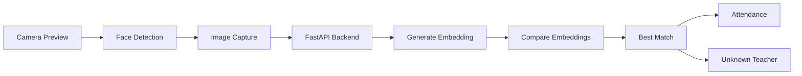

# Face Recognition System

**Project:** Face-Mark

**Version:** 1.0

---

# 1. Overview

The Face Recognition System is the core intelligence behind Face-Mark. It enables automatic teacher identification by comparing a live camera image against previously enrolled facial embeddings.

Unlike traditional attendance systems that rely on manual input, QR codes, or fingerprint scanners, Face-Mark performs touchless identification using computer vision and facial recognition.

The recognition pipeline is divided into five stages:

1. Face Detection
2. Face Capture
3. Embedding Generation
4. Similarity Matching
5. Attendance Decision

---

# 2. Recognition Pipeline



---

# 3. System Components

| Component        | Responsibility                 |
| ---------------- | ------------------------------ |
| Flutter Camera   | Live preview and image capture |
| Google ML Kit    | Detect faces on-device         |
| FastAPI          | Recognition orchestration      |
| face_recognition | Facial encoding                |
| NumPy            | Similarity calculations        |
| embeddings.json  | Stores teacher embeddings      |
| Firestore        | Stores attendance records      |

---

# 4. Face Enrollment

## Purpose

Register a teacher by generating a reusable facial embedding.

---

## Workflow

1. Administrator selects a teacher.
2. Camera preview starts.
3. Face detected.
4. Image captured.
5. Backend generates embedding.
6. Embedding stored locally.
7. Teacher marked as enrolled.

---

## Requirements

The system must ensure:

* Exactly one face is visible.
* Image quality is acceptable.
* Embedding generation succeeds.
* Teacher exists before enrollment.

---

# 5. Face Detection

Face detection occurs before recognition.

Google ML Kit detects the presence and location of a face on the device.

Benefits include:

* Reduced backend processing
* Lower bandwidth usage
* Faster user feedback

Recognition does not begin until a valid face is detected.

---

# 6. Embedding Generation

The captured image is sent to the backend.

The backend:

1. Detects the face.
2. Aligns the image if necessary.
3. Generates a numerical embedding.
4. Normalizes the embedding.

Each embedding is a high-dimensional vector representing the unique facial characteristics of a teacher.

---

# 7. Embedding Storage

Embeddings are stored in:

```text
backend/embeddings.json
```

Multiple embeddings per teacher are supported in Version 1.0 to improve robustness. A centroid vector is calculated across all stored encodings during identification.

---

# 8. Similarity Matching

During recognition:

1. Generate embedding for the captured image.
2. Load registered embeddings.
3. Compute similarity scores.
4. Select the closest match.
5. Validate against the configured threshold.

If no embedding exceeds the threshold, the teacher is considered unknown.

---

# 9. Recognition Decision

The backend returns one of two outcomes:

## Match Found

* Teacher identified
* Attendance process begins
* Administrator notified

---

## Unknown

* Attendance rejected
* User informed that recognition failed
* Event optionally logged

---

# 10. Performance Targets

| Metric               | Target  |
| -------------------- | ------- |
| Face detection       | <300 ms |
| Embedding generation | <500 ms |
| Similarity matching  | <200 ms |
| Total recognition    | <2 s    |
| Recognition accuracy | >95%    |

---

# 11. Failure Scenarios

| Scenario            | Expected Behaviour            |
| ------------------- | ----------------------------- |
| No face detected    | Continue scanning             |
| Multiple faces      | Reject recognition            |
| Poor lighting       | Request better positioning    |
| Blurred image       | Discard frame                 |
| Unknown teacher     | Do not record attendance      |
| Backend unavailable | Retry or notify administrator |

---

# 12. Security Considerations

* Facial embeddings are never exposed through the API.
* Original images are processed only for recognition.
* Embeddings are stored separately from attendance records.
* Only authenticated administrators can enroll teachers.

---

# 13. Current Limitations

The Version 1.0 implementation has the following limitations:

* Local JSON storage for embeddings.
* Internet connection required.
* No liveness detection.
* No anti-spoofing.
* Android-only client.

---

# 14. Future Improvements

Future versions may introduce:

* Vector database for embedding storage.
* Face anti-spoofing.
* Liveness detection.
* Offline recognition.
* GPU-accelerated inference.
* Confidence calibration.
* Automatic embedding quality assessment.

---

# 15. Summary

The Face Recognition System is the foundation of Face-Mark. By combining on-device face detection with backend facial recognition, it provides a fast, touchless, and scalable attendance experience while keeping the implementation modular and maintainable.

---

# End of Document
