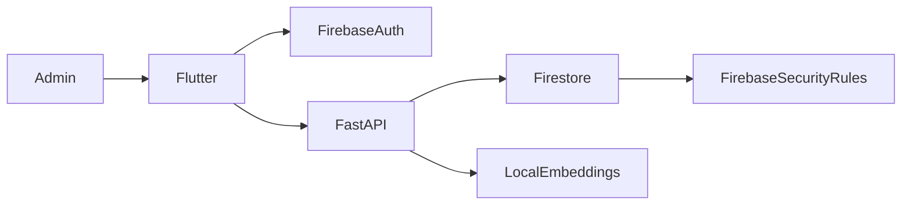

# Security

**Project:** Face-Mark

**Version:** 1.0

---

# 1. Overview

Face-Mark handles personally identifiable information (PII), attendance records, and biometric data. As a result, security is a core architectural concern rather than an optional feature.

This document defines the security model, trust boundaries, authentication mechanisms, authorization rules, data protection strategies, and operational best practices for the system.

---

# 2. Security Objectives

The primary objectives of Face-Mark are:

* Protect administrator accounts.
* Protect attendance records.
* Prevent unauthorized API access.
* Secure biometric information.
* Prevent data tampering.
* Ensure auditability.
* Minimize exposure of sensitive information.

---

# 3. Security Architecture



The system separates authentication, application logic, cloud data, and local biometric storage to reduce the impact of a compromise.

---

# 4. Authentication

## Administrator Authentication

Face-Mark uses **Firebase Authentication** for administrator sign-in.

Responsibilities:

* Identity verification
* Session management
* Token generation
* Secure sign-out

Passwords are **never stored by Face-Mark**.

---

## Authentication Flow

1. Administrator enters credentials.
2. Firebase verifies identity.
3. Firebase issues an ID token.
4. Flutter includes the token in authenticated requests.
5. Backend validates the token before executing protected operations.

---

# 5. Authorization

Only authenticated administrators are permitted to:

* Register teachers.
* Delete teachers.
* Enroll faces.
* View attendance history.
* Modify teacher records.
* Receive administrator notifications.

Future versions may introduce role-based permissions such as:

* Super Administrator
* Administrator
* Operator
* Read-only Auditor

---

# 6. API Security

The backend must:

* Validate every request.
* Reject malformed payloads.
* Verify authentication before protected actions.
* Sanitize all input.
* Return appropriate HTTP status codes.

Production deployments should enforce HTTPS for all API communication.

---

# 7. Firestore Security

Firestore security rules should ensure:

* Unauthenticated users cannot access data.
* Only authorized administrators can read or modify teacher records.
* Attendance records cannot be modified by unauthorized clients.
* Device registration is restricted to authenticated users.

The backend should remain the primary authority for attendance creation and recognition.

---

# 8. Biometric Data Protection

Facial embeddings are stored locally in:

```text
backend/embeddings.json
```

Guidelines:

* Do not expose embeddings through any API.
* Do not commit embeddings to version control.
* Restrict filesystem access to the backend process.
* Back up embeddings securely.

Profile images stored in `profile_photos/` should be treated as sensitive assets and excluded from Git.

---

# 9. Data Protection

Sensitive information includes:

* Teacher names
* Attendance history
* Facial embeddings
* Profile images
* Firebase tokens

The system should collect only the data required for attendance management and avoid unnecessary retention.

---

# 10. Input Validation

Every API endpoint should validate:

* Required fields
* Data types
* Image format
* Payload size
* Identifier existence

Invalid requests should fail safely without affecting existing records.

---

# 11. Error Handling

Security-related errors should:

* Avoid exposing internal implementation details.
* Return generic messages to clients.
* Log sufficient information for debugging on the server.

Example:

**Do**

```text
Authentication failed.
```

**Avoid**

```text
Teacher TCH001 not found in Firestore collection.
```

---

# 12. Logging & Auditing

The backend should log:

* Administrator logins
* Failed authentication attempts
* Teacher registration
* Teacher deletion
* Face enrollment
* Attendance events
* Recognition failures
* API exceptions

Logs should not include facial embeddings or raw images.

---

# 13. Rate Limiting

To reduce abuse, future deployments should introduce rate limiting.

Examples:

* Login attempts per minute
* Face recognition requests per second
* API request throttling
* Notification limits

---

# 14. Secrets Management

The following should never be committed to the repository:

* Firebase service account keys
* API secrets
* Production configuration
* Environment variables
* Generated embeddings
* Cached profile images

Secrets should be stored using environment variables or secure secret managers.

---

# 15. Backup & Recovery

Recommended strategy:

* Firestore managed backups.
* Secure backup of `embeddings.json`.
* Secure backup of `profile_photos/`.
* Versioned backups for production deployments.

Recovery procedures should be documented and tested periodically.

---

# 16. Known Limitations

Current Version 1.0 limitations include:

* Local embedding storage.
* No liveness detection.
* No anti-spoofing.
* No role-based access control.
* No API rate limiting.

These limitations are acceptable for the MVP but should be addressed in future releases.

---

# 17. Future Security Enhancements

Planned improvements:

* Liveness detection.
* Face anti-spoofing.
* Encryption of facial embeddings at rest.
* API rate limiting.
* Role-based access control (RBAC).
* Audit log collection.
* Centralized monitoring.
* Automated vulnerability scanning.
* Multi-factor authentication for administrators.

---

# 18. Security Checklist

Before deploying Face-Mark:

* Firebase Authentication configured.
* Firestore rules reviewed.
* HTTPS enabled.
* Secrets stored securely.
* Sensitive files ignored by Git.
* Logging configured.
* Backups tested.
* Production environment verified.

---

# End of Document
